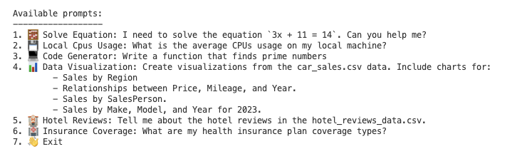

# Azure AI Agent Service Demo

This demo originally started out using the code from the [Azure AI Agent QuickStart](https://learn.microsoft.com/azure/ai-services/agents/quickstart), but has expanded to show different agent tooling features:

- Perform a simple calculation (no tools)
- Make function calls using Function Calling Tools
- Create a function using code interpreter
- Examine a CSV file and create diagrams from it using code interpreter
- Examine a CSV file and provide analysis using code interpreter
- Perform RAG functionality using AI search
- Use real-time public web data using Bing Grounding
- Return usage stats about in/out tokens



## AI Foundry Project Setup

To use the demo you'll need to create an Azure AI Foundry project by following the [QuickStart](https://learn.microsoft.com/azure/ai-services/agents/quickstart?pivots=programming-language-javascript). 

## AI Search Tooling Setup

If you'd like to use the AI Search/RAG functionality in the demo, you'll find details about the setup in the [AI Search tooling](https://learn.microsoft.com/azure/ai-services/agents/how-to/tools/azure-ai-search?tabs=azurecli%2Cjavascript&pivots=code-examples) document. You'll need to:

- Add the health documents in `files` to an Azure Blob Storage container.
- Import the health documents into an Azure AI Search index using the [Azure AI Search Importer](https://learn.microsoft.com/en-us/azure/search/search-get-started-portal-import-vectors).
- Create a connection to the AI Search resource in your AI Foundry project. See [Use an existing AI Search index with the Azure AI Search tool](https://learn.microsoft.com/azure/ai-services/agents/how-to/tools/azure-ai-search?tabs=azurecli%2Cjavascript&pivots=code-examples#import-documents-into-an-index).

## Bing Grounding Tooling Setup

If you'd like to use the Bing Grounding functionality in the demo, you'll find details about the setup in the [Bing Grounding tooling](https://learn.microsoft.com/azure/ai-services/agents/how-to/tools/bing-grounding?tabs=azurecli%2Cjavascript&pivots=code-examples) document.

## Running the Demo

After going through the QuickStart steps (and optionally the AI Search and Bing Grounding tooling setup), perform the following steps:

1. Rename `.env.template` to `.env`.

1. Assign your Azure AI Foundry endpoint, your AI Search connection ID, the AI Search index name, and the Bing Grounding connection ID from Azure AI Foundry to the appropriate env keys. You can optionally change the model deployment name.

    ```bash
    AI_FOUNDRY_PROJECT_ENDPOINT=https://<your-endpoint>.services.ai.azure.com/api/projects/<your-project>
    AI_SEARCH_CONNECTION_ID=/subscriptions/<subscription-id>/resourceGroups/<resource-group>/providers/Microsoft.CognitiveServices/accounts/<account-name>/projects/<project-name>/connections/<connection-name>
    AI_SEARCH_INDEX_NAME=<your-index-name>
    BING_GROUNDING_CONNECTION_ID=/subscriptions/<subscription-id>/resourceGroups/<resource-group>/providers/Microsoft.CognitiveServices/accounts/<account-name>/projects/<project-name>/connections/<connection-name>
    ```

1. Install the project dependencies:

    ```bash
    npm install
    ```

1. Start the demo:
    ```bash
    npm start
    ```

1. Select an agent demo to run.

## Additional Resources

If you get stuck or have any questions about building AI apps, join our [Azure AI Foundry Community Discord](https://discord.com/invite/kzRShWzttr)

If you have product feedback or errors while building visit our [Azure AI Foundry Developer Forum](https://github.com/orgs/azure-ai-foundry/discussions)
