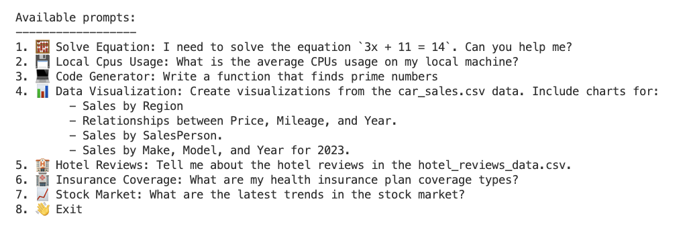

# Azure AI Agent Service Demo

This demo originally started out using the code from the [Azure AI Agent QuickStart](https://learn.microsoft.com/azure/ai-services/agents/quickstart), but has expanded to show different agent tooling features:

- Perform a simple calculation (no tools)
- Make function calls using Function Calling Tools
- Create a function using code interpreter
- Examine a CSV file and create diagrams from it using code interpreter
- Examine a CSV file and provide analysis using code interpreter
- Perform RAG functionality using AI search
- Use real-time public web data using Bing Grounding
- Return usage stats about in/out tokens



To use the demo you'll need to complete the steps in the [QuickStart](https://learn.microsoft.com/azure/ai-services/agents/quickstart) to set up your Azure AI Foundry project. If you'd like to use the AI Search/RAG functionality in the demo, you'll find details about the setup in the [AI Search tooling](https://learn.microsoft.com/azure/ai-services/agents/how-to/tools/azure-ai-search?tabs=azurecli%2Cjavascript&pivots=code-examples) document.

## Running the Demo

After going through the QuickStart steps (and optionally the AI Search and Bing Grounding tooling setup), perform the following steps:

1. Rename `.env.template` to `.env`.

1. Assign your Azure AI Foundry connection string, your AI Search and Bing Grounding connection name from Azure AI Foundry, and (optionally) the model deployment name to the `.env` file keys.

1. Install the project dependencies:

    ```bash
    npm install
    ```

1. Start the demo:
    ```bash
    npm start
    ```

